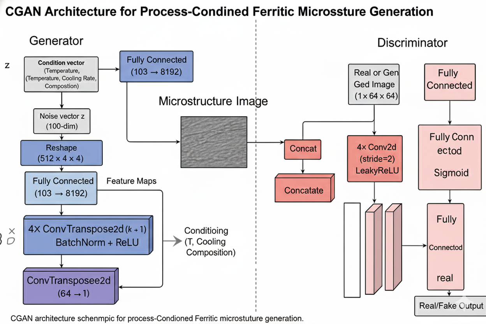

# Conditional GAN for Ferritic Steel Microstructure Generation
**Author:** Satyanarayan Mohapatro  
**Domain:** Materials Informatics / Deep Generative Modeling  
**Project:** Ferritic Steel Microstructure Synthesis using Conditional GAN (CGAN)  
**In Collaboration With:** CAMMP (Center for Advanced Modeling of Materials & Manufacturing Processes)

---

##  Overview
This repository contains the complete implementation of a **Conditional Generative Adversarial Network (CGAN)** designed to generate **ferritic steel microstructure images** conditioned on process parameters or labels.

The project explores:
- DCGAN baseline  
- Enhanced DCGAN  
- Pseudo-label CGAN  
- Hyperparameter-optimized CGAN  
- Final *real-condition CGAN* with process-driven conditioning  
- FID evaluation and best-model tracking  
- Microstructure visualization and trend analysis  

This project demonstrates how machine learning can be used to synthetically generate metallurgical microstructures with high fidelity.

---

---

##  Key Features
- ✔ Complete CGAN architecture (Generator + Discriminator)
- ✔ Conditioning using one-hot or continuous metallurgical parameters
- ✔ FID score evaluation every 10 epochs
- ✔ Automatic checkpoint saving (best FID model + epoch checkpoints)
- ✔ DCGAN baseline for comparison
- ✔ Detailed results visualization
- ✔ 200-epoch full CGAN training pipeline (GPU optimized)
- ✔ Grain / texture realism improvement tracked using metrics

---

##  Training Details

| Parameter      | Value     |
|----------------|-----------|
| Epochs         | 200       |
| Batch Size     | 64        |
| Latent Vector  | 100       |
| Optimizer      | Adam      |
| Learning Rate  | 0.0002    |
| Loss Function  | BCE       |

- **FID computed every 10 epochs**  
- **Checkpoints saved every 20 epochs**  
- **Best model automatically tracked using lowest FID**

---

## Results Summary

**Best FID Achieved:** ≈ 0.70   

### **Observations**
- Generated images show sharp and realistic ferritic textures  
- Conditional labels effectively control microstructure variations  
- FID score consistently decreased across training, indicating improved realism  

---

##  Acknowledgements

Special thanks to **Akash Sir** and **CAMMP** for their consistent guidance and evaluation support throughout the project.

---

##  Contact

For any queries or discussions:

**Satyanarayan Mohapatro**  
Email: *satyaamohapatro@gmail.com*  

---

